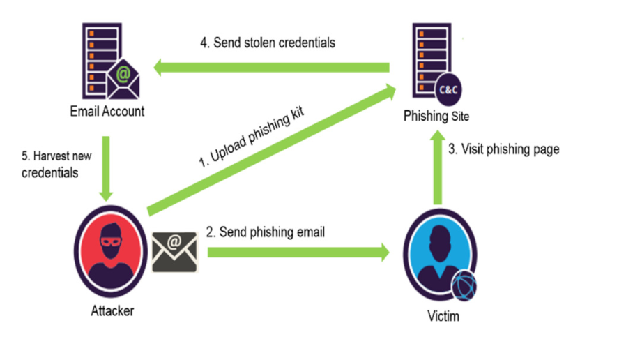

## Phishing Domain Detection
----

# **Problem Statement**
#### Phishing is a type of fraud in which an attacker impersonates a reputable company or person in order to get sensitive information such as login credentials or account information via email or other communication channels. Phishing is popular among attackers because it is easier to persuade someone to click a malicious link that appears to be authentic than it is to break through a computer's protection measures.

#### Objective
#### The mail goal is to predict whether the domains are real or malicious.

#### **Key Project Details:**

1. **URL Structure Analysis:**  
   Phishing URLs often contain abnormal patterns such as excessive use of special characters (e.g., ‘@’, ‘//’, or ‘-’), suspicious domain names, or long and complex URLs. These features can help in identifying malicious websites.

2. **Domain Features:**  
   Phishing domains often have a short lifespan, and many lack proper registration details (WHOIS data). Analyzing domain age and registrar information can be key indicators in phishing detection.

3. **Use of IP Addresses in URLs:**  
   Legitimate websites rarely use raw IP addresses in URLs, while phishing websites often do. Identifying this feature can improve detection accuracy.

--------

# **Project Summary**

---
#### ***Project Description:***
<h4>
Phishing stands for a fraudulent process, where an attacker tries to obtain sensitive information from the victim. Usually, these kinds of attacks are done via emails, text messages, or websites. Phishing websites, which are nowadays in a considerable rise, have the same look as legitimate sites. However, their backend is designed to collect sensitive information that is inputted by the victim. Discovering and detecting phishing websites has recently also gained the machine learning community’s attention, which has built the models and performed classifications of phishing websites. This paper presents two dataset variations that consist of 58,645 and 88,647 websites labeled as legitimate or phishing and allow the researchers to train their classification models, build phishing detection systems, and mining association rules.
</h4>

#### **Objective**

#### Create a model which is capable enough to detect whether the system is hacked or not

#### **Key Project Details:**

1. **URL Structure Analysis:**  
   Phishing URLs often contain abnormal patterns such as excessive use of special characters (e.g., ‘@’, ‘//’, or ‘-’), suspicious domain names, or long and complex URLs. These features can help in identifying malicious websites.

2. **Domain Features:**  
   Phishing domains often have a short lifespan, and many lack proper registration details (WHOIS data). Analyzing domain age and registrar information can be key indicators in phishing detection.
   

4. **Use of IP Addresses in URLs:**  
   Legitimate websites rarely use raw IP addresses in URLs, while phishing websites often do. Identifying this feature can improve detection accuracy.

--------

# **Result**
I have selected recall as the primary evaluation metric for the phishing domain detection model. And after removing the overfitted models which have recall, precision, f1 scores for train as 100%, we get the final list:
| Sl. No. | Classification Model      |   Recall Train (%) |   Recall Test (%) |
|:--------|:--------------------------|---------------:|--------------:|
|    1    | Decision Tree tuned       |       95.24  |      95.56 |
|    2    | Decesion Tree tuned       |       97.14  |      97.78 |
|    3    | Naive Bayes               |       94.28 |      97.78 |
|    4    | Naive Bayes tuned         |       94.28 |      97.78 |

## Conclusion

In the Iris ishing domain detection project, the tuned decesion tree model has been selected as the final prediction model. The project aimed to detect the phisihing domains base on input url After extensive data exploration, preprocessing, and model evaluation, the following conclusions can be drawn:

1. **Data Exploration:** Through a thorough examination of the dataset, we gained insights into the characteristics and distributions of features. We found that phishing domain url distinct features compared to the legitimate urls.

2. **Data Preprocessing:** Data preprocessing steps, including handling missing values and encoding categorical variables, were performed to prepare the dataset for modeling.

3. **Model Selection:** After experimenting with various machine learning models, tuned Decesion tree was choosen as the final model due to its simplicity, interpretability, and good performance in classifying phishing or legitimate url.

4. **Model Training and Evaluation:** The decesion tree (tuned) model was trained on the training dataset and evaluated using appropriate metrics. The model demonstrated satisfactory accuracy and precision in classifying Iris species.

5. **Challenges and Future Work:** The project encountered challenges related to feature engineering and feature selection and model fine-tuning. Future work may involve exploring more advanced modeling techniques to improve classification accuracy further.

6. **Practical Application:** The phishing domain detection model can be applied in real-world scenarios, such as cyber securtiy and network security, to automate the identification of phishing url based on distinctive properties.

In conclusion, the phishing domain detection  project successfully employed decesion tree (tuned) as the final prediction model to classify Iris species. The project's outcomes have practical implications in the field of botany and offer valuable insights into feature importance for species differentiation. Further refinements and enhancements may lead to even more accurate and reliable classification models in the future.

---

## Author

- [Kazi Sahim](https://www.linkedin.com/in/sahim-kazi-1406431b9/)

---

## Reference

The notebook can be seen as a reference
- [EDA](https://github.com/QaziSaim/Phishing-Domain-Detection/blob/main/notebook/PhishingClassifierProject.ipynb)
- [Model Training](https://github.com/QaziSaim/Phishing-Domain-Detection/blob/main/notebook/ModelBuilding.ipynb)

- 

