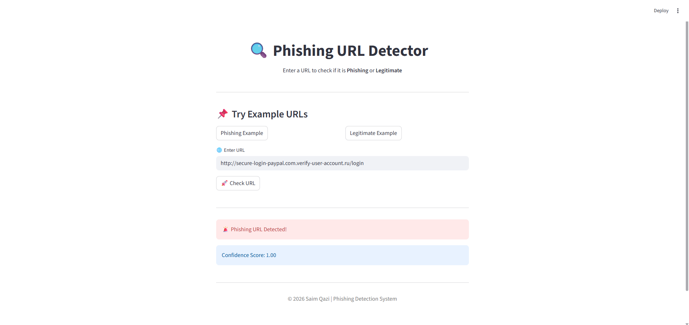
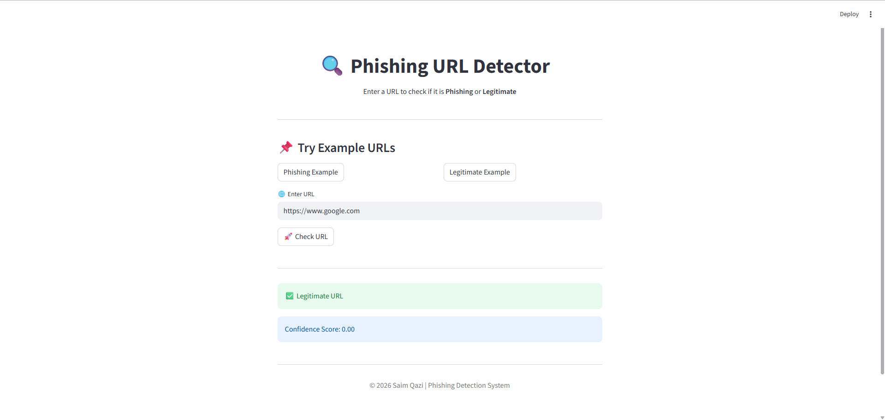
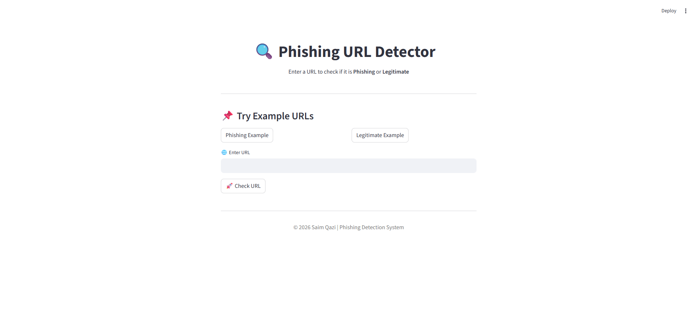

# 🔍 Phishing Domain Detection

## 📌 Problem Statement

Phishing attacks use malicious URLs that mimic legitimate websites to steal sensitive information such as login credentials and financial data. Detecting such URLs is critical to enhance cybersecurity and protect users.

---

## 🎯 Objective

To build a machine learning model that can accurately classify whether a given URL is **phishing** or **legitimate** based on engineered URL features.

---

## 📊 Dataset

* Source: Kaggle
* The dataset contains URLs along with labels and extracted features.

---

## 🧾 Dataset Schema

| Column Name     | Data Type | Description                                    |
| --------------- | --------- | ---------------------------------------------- |
| url             | object    | Original URL                                   |
| label           | object    | Label (phishing/legitimate)                    |
| result          | int64     | Target variable (1 = phishing, 0 = legitimate) |
| url_length      | int64     | Length of URL                                  |
| hostname_length | int64     | Length of domain                               |
| path_length     | int64     | Length of path                                 |
| fd_length       | int64     | First directory length                         |
| count-          | int64     | Count of '-'                                   |
| count@          | int64     | Count of '@'                                   |
| count?          | int64     | Count of '?'                                   |
| count%          | int64     | Count of '%'                                   |
| count.          | int64     | Count of '.'                                   |
| count=          | int64     | Count of '='                                   |
| count-http      | int64     | Count of 'http'                                |
| count-https     | int64     | Count of 'https'                               |
| count-www       | int64     | Count of 'www'                                 |
| count-digits    | int64     | Number of digits                               |
| count-letters   | int64     | Number of letters                              |
| count_dir       | int64     | Number of directories                          |
| use_of_ip       | int64     | IP usage flag (-1 suspicious, 1 safe)          |
| short_url       | int64     | URL shortening flag                            |

---

## ⚙️ Data Processing

* Removed invalid and missing URLs
* Extracted **18+ meaningful features** from URLs
* Handled class imbalance using **SMOTE**
* Applied **train-validation-test split (70-15-15)**
* Standardized features for scale-sensitive models

---

## 🤖 Model Used

* **Random Forest Classifier**

  * Handles non-linear relationships
  * Robust to outliers
  * No need for feature scaling

---

## 📈 Model Performance

* **Recall Accuracy:** `0.9972` ✅

👉 High recall ensures **maximum phishing URLs are detected**, which is critical in cybersecurity applications.

---

## 🚀 Features of the Project

* Real-time URL feature extraction
* High-performance ML model
* Streamlit web application for prediction
* Scalable and production-ready pipeline

---

## 🖥️ Usage

### 1. Clone the repository

```bash
git clone <your-repo-link>
cd phishing-detection
```

### 2. Install dependencies

```bash
pip install -r requirements.txt
```

### 3. Run Streamlit app

```bash
streamlit run app.py
```

Here’s a clean section you can **add to your README.md** 👇

---

## 🌐 Deployment

The project has been successfully deployed on **Streamlit Cloud** using Streamlit.

👉 You can test the live application here:
**🔗 [Add Your Streamlit App Link Here]**

---

## 📸 Application Preview

Below is a screenshot of the deployed application:





---

## 🚀 How to Use the Live App

1. Open the deployed link
2. Enter any URL
3. Click on **“Check URL”**
4. The model will predict whether the URL is:

   * 🚨 Phishing
   * ✅ Legitimate

---

## 🎯 Note

* The model uses real-time feature extraction
* Predictions are based on a trained **Random Forest model**
* High recall ensures better detection of phishing URLs


---

## 🔮 Future Improvements

* Deploy model using FastAPI
* Add deep learning models (LSTM/Transformer)
* Integrate real-time threat intelligence APIs
* Improve feature engineering with NLP

---

## 👨‍💻 Author

**Saim Qazi**

---

## 📄 License

This project is for educational and research purposes.


✅ Write **LinkedIn post for this project**
✅ Help you **deploy this project online** 🚀
